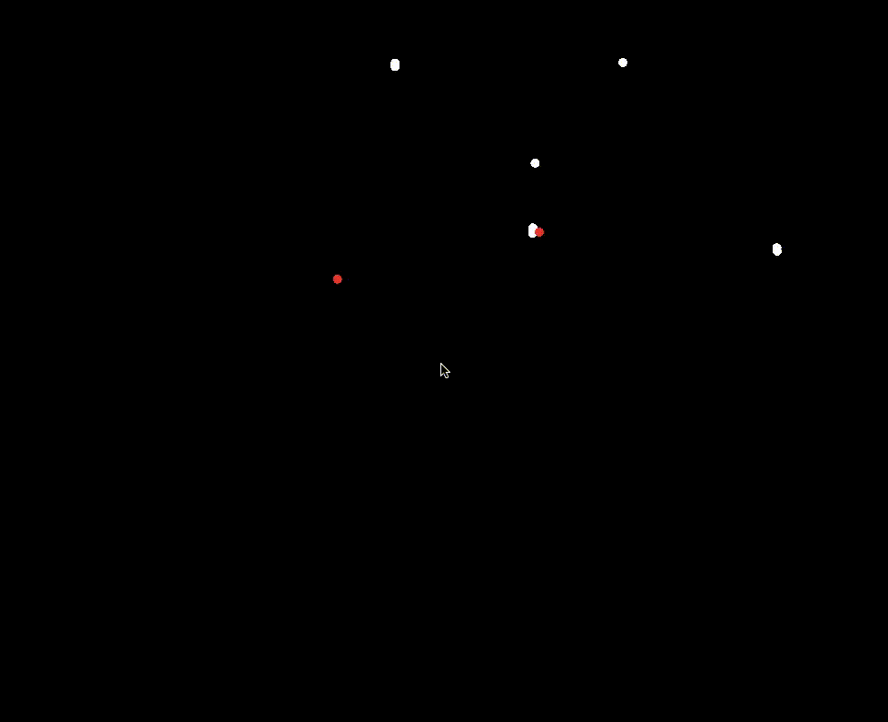

<!---

-->

# nbody
an n-body gravitational simulation using brute force and Barnes-Hut methods, visualized.

## Instructions
libraries: brew install sfml  
compile: make  
run: ./nbody  

## Notes
Work in progress. Barnes-Hut method yet to be implemented.

### Code-Related

## Improvements
Implement Barnes-Hut tree
Procedurally generate galaxy
Procedurally generate stable systems